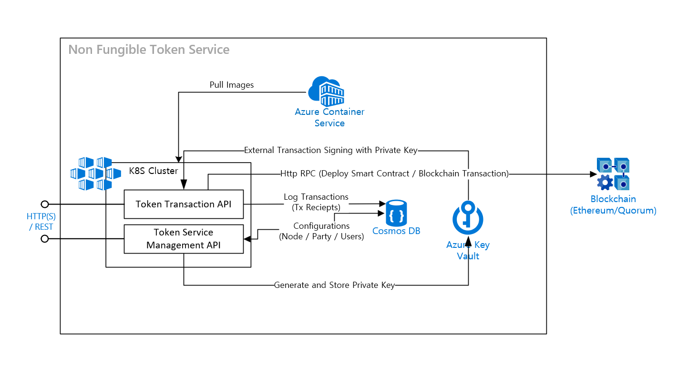

# About this Repository
Welcome to the world of distributed applications!  

This repo is for a Azure Non-fungible Token Solution Accelerator that leverages the [ERC 721 Token Standard](https://ethereum.org/en/developers/docs/standards/tokens/erc-721/) to help manage transactions on [Enterprise Blockchain Services](https://ethereum.org/en/enterprise/private-ethereum/) like [Ethereum](https://ethereum.org/en/enterprise/), [Quorum](https://consensys.net/quorum/) and [Hyperledger Besu](https://www.hyperledger.org/use/besu)  

It supports all ERC 721 Token transactions and provides several features to assist in managing Blockchain Networks, Consortium Parties, as well as private key transactions.

## Features
With this Azure Non-fungible Token Solution Accelerator, you can take advantage of:  
   * HTTP REST APIs for ERC 721 Token Functions [(ERC 721 Token API)](./documents/ERC721TokenAPI.md)  
    - ERC 721 Token Smart Contract Deployment  
    - [TTF Token Definition](https://github.com/InterWorkAlliance/TokenTaxonomyFramework) nFmbtg -(Non Fingible, Burnable, Transferrable, Delegatable) Token operations
      
   * HTTP REST APIs for DApp Configurational and Operational Functions [(Token Service Management API)](./documents/ServiceManagementAPI.md)  
    - Manage Extenal Account with Private Key  
    - Manage Blockchain RPC Transaction Node  
    - Manage Consortium Party
   
   * Supports User's Key Management and External Transaction Signing  
    - Automatically load User's Private Key and External Sign and Submit Transaction
   
   * Logging every Token Transactions  
    - Indexing every Token Transactions in Cosmos DB

## Prerequisites
In order to successfully deploy this solution accelerator, you will need to have access to and/or provision the following resources:   
 
 1. [Access to an Azure Subscription](http://portal.azure.com), with required permissions - Required to deploy compute resources
 2. [PowerShell 7.1](https://docs.microsoft.com/en-us/powershell/scripting/install/installing-powershell?view=powershell-7.1) - Required to run deployment scripts
 3. [Azure CLI](https://docs.microsoft.com/en-us/cli/azure/install-azure-cli) installed - Required for deployment scripts to be run
 4. [Docker Desktop](https://hub.docker.com/editions/community/docker-ce-desktop-windows) - Required for debugging on your local machine or containerizing codes in the Deployment process
 5. [User Access Administrator](https://docs.microsoft.com/en-us/azure/role-based-access-control/built-in-roles#user-access-administrator) Role - Assigned to the user in Azure Subscription
 
## Architecture Overview
The architecture diagram below details what you will be building for this Solution Accelerator.  

## Getting Started 

Clone/download this repo onto your computer and then proceed through the steps below. After completion of all steps, you will have a working end-to-end solution:

### [01. Azure Resources Deployment](./deployment/ARMTemplates/ResourceDeployment.md):
The resources in this folder can be used to deploy the required cloud services into your Azure Subscription. This can be done either via the [Azure Portal](https://portal.azure.com) or by using the [PowerShell script](./deployment/ARMTemplates/Bicep/resourcedeployment.ps1) included in the deployment folder.

After deployment, you will have an Azure Container Registry, Azure Kubernetes Service, Azure Key Vault, Azure Cosmos DB Account, and Virtual Machine with Quorum.

Resources can also be deployed into your Azure Subscription by using one of these Deploy Azure links:  

&emsp;&emsp;&emsp;
&emsp;&emsp;&emsp;

**Note: Follow "Step 3" in [Azure Resources Deployment](./deployment/ARMTemplates/ResourceDeployment.md#step-3-configure-managed-identity) to configure managed identity permission if you have deployed resources using above Azure links.**
 
### [02. Quorum Configuration](./deployment/ARMTemplates/QuorumConfiguration.md):
After the resource deployment step, you will need to configure the Quorum Service. Follow the steps given in the [quorum configuration guide](./deployment/ARMTemplates/QuorumConfiguration.md) to configure and deploy the quorum service.

### [03. Token Service Deployment](./deployment/NFTTokenService/ApplicationDeployment.md):
This folder contains a [PowerShell script](./deployment/NFTTokenService/deployapplications.ps1) that will build a docker image, from Token Service's source code, and deploy that to an Azure Kubernetes Service Cluster, using a YAML manifest file. 

### [04. Solution Testing](./documents/NFTSampleConsoleApp.md):
This reposity contains a [sample console app](./documents/NFTSampleConsoleApp.md) that can be used to test the solution.

## Folders

- [deployment](./deployment): Contains resource deployment scripts to deploy the resources required for Quorum and Token Service. 
- [documents](./documents): Contains API and Sample Application Descriptions  
- [manifests](./manifests): Kubernetes yaml file  
- [sdk](./SDK): SDK source code to access NFT Token APIs. The Sample Application shows how to use the SDK to access the NFT Token API. Please check [NFTSampleConsoleApp](./src/Solutions.NFT.ConsoleApp)  
- [src](./src): Contains all source code for the NFT Token Solution Accelerator  
    - [Solutions.HTTP](./src/Solutions.HTTP) - HTTP REST API Invokation Utility with Retry Policy  
    - [Solutions.NFT.ConsoleApp](./src/Solutions.NFT.ConsoleApp) - Sample Application for NFT Token APIs  
    - [Solutions.Security.Cosmos](./src/Solutions.Security.Cosmos) - Cosmos DB Connection String Retriever with Azure Managed Identity  
    - [Solutions.TokenService.API](./src/Solutions.TokenService.API) - NFT Token Service API Web Host 
    - [Solutions.TokenService.BlockchainNetworkManager](./src/Solutions.TokenService.BlockchainNetworkManager) - Blockchain Network Management Service  
    - [Solutions.TokenService.KeyManagement](./src/Solutions.TokenService.KeyManagement) - Blockchain Transaction External Signing Utility with Azure KeyVault  
    - [Solutions.TokenService.LedgerClient](./src/Solutions.TokenService.LedgerClient) - ERC721 Token Smart Contract and Transaction Wrapper Classes  
    - [Solutions.TokenService.PartyManager](./src/Solutions.TokenService.PartyManager) - Blockchain Consortium Party Management Service  
    - [Solutions.TokenService.TransactionIndexer](./src/Solutions.TokenService.TransactionIndexer) - Blockchain Transaction Indexing Service  
    - [Solutions.TokenService.UserManager](./src/Solutions.TokenService.UserManager) - Blockchain User Management Service  
 

## Microsoft Open Source Code of Conduct

This project has adopted the [Microsoft Open Source Code of Conduct](https://opensource.microsoft.com/codeofconduct/).

Resources:
- [Microsoft Open Source Code of Conduct](https://opensource.microsoft.com/codeofconduct/)
- [Microsoft Code of Conduct FAQ](https://opensource.microsoft.com/codeofconduct/faq/)
- Contact [opencode@microsoft.com](mailto:opencode@microsoft.com) with questions or concerns

## License
Copyright (c) Microsoft Corporation

All rights reserved.

MIT License

Permission is hereby granted, free of charge, to any person obtaining a copy of this software and associated documentation files (the ""Software""), to deal in the Software without restriction, including without limitation the rights to use, copy, modify, merge, publish, distribute, sublicense, and/or sell copies of the Software, and to permit persons to whom the Software is furnished to do so, subject to the following conditions:

The above copyright notice and this permission notice shall be included in all copies or substantial portions of the Software.

THE SOFTWARE IS PROVIDED AS IS, WITHOUT WARRANTY OF ANY KIND, EXPRESS OR IMPLIED, INCLUDING BUT NOT LIMITED TO THE WARRANTIES OF MERCHANTABILITY, FITNESS FOR A PARTICULAR PURPOSE AND NONINFRINGEMENT. IN NO EVENT SHALL THE AUTHORS OR COPYRIGHT HOLDERS BE LIABLE FOR ANY CLAIM, DAMAGES OR OTHER LIABILITY, WHETHER IN AN ACTION OF CONTRACT, TORT OR OTHERWISE, ARISING FROM, OUT OF OR IN CONNECTION WITH THE SOFTWARE OR THE USE OR OTHER DEALINGS IN THE SOFTWARE

## Contributing

This project welcomes contributions and suggestions.  Most contributions require you to agree to a
Contributor License Agreement (CLA) declaring that you have the right to, and actually do, grant us
the rights to use your contribution. For details, visit https://cla.opensource.microsoft.com.

When you submit a pull request, a CLA bot will automatically determine whether you need to provide
a CLA and decorate the PR appropriately (e.g., status check, comment). Simply follow the instructions
provided by the bot. You will only need to do this once across all repos using our CLA.

This project has adopted the [Microsoft Open Source Code of Conduct](https://opensource.microsoft.com/codeofconduct/).
For more information see the [Code of Conduct FAQ](https://opensource.microsoft.com/codeofconduct/faq/) or
contact [opencode@microsoft.com](mailto:opencode@microsoft.com) with any additional questions or comments.

## Trademarks

This project may contain trademarks or logos for projects, products, or services. Authorized use of Microsoft 
trademarks or logos is subject to and must follow 
[Microsoft's Trademark & Brand Guidelines](https://www.microsoft.com/en-us/legal/intellectualproperty/trademarks/usage/general).
Use of Microsoft trademarks or logos in modified versions of this project must not cause confusion or imply Microsoft sponsorship.
Any use of third-party trademarks or logos are subject to those third-party's policies.
