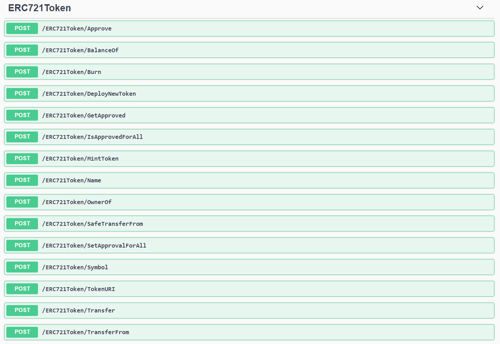

# ERC 721 Token Service API
The ERC 721 NFT Token Service API provides [ERC 721 Token Standard](https://ethereum.org/en/developers/docs/standards/tokens/erc-721/) transactional functions.  
The Smart Contract used in this service follows the [ERC 721: Non-Fungible token standard proposal](https://eips.ethereum.org/EIPS/eip-721).

When using this API, be aware of specific requirements related to the User's account. 
Normally an ERC 721 transaction requires that the user's account(public key) be passed, but here you need to pass the User's ID, instead of the user's public key, as a parameter for each token transaction.  
The ERC 721 API service retrieve the User's public key and coresponding private key, then signs the transaction before submitting it to Blockchain network, so you don't need to manage each user's keys out side of the box.  

Before transacting with the  ERC 721 Token Service API, you must register the Blockchain node, Party, and User information. 

You can find the SDK code for using these APIs in [.\SDK folder](../SDK).

