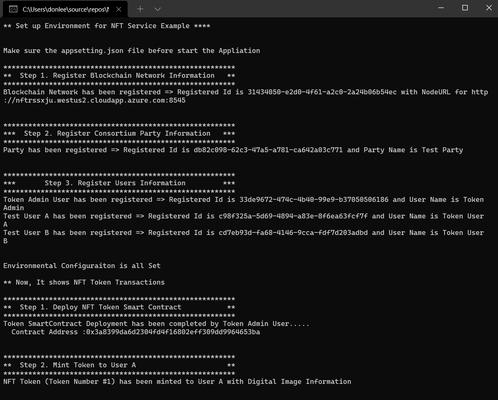

## Prerequisites
 1. [Resource Deployment](../deployment/ARMTemplates/ResourceDeployment.md)
 2. [Application Deployment](../deployment/NFTTokenService/ApplicationDeployment.md)

Make sure the previous steps are completed before you run the sample console app. Previous steps will change the ***appsettings.json*** in this project to have the required values. 

## NFTSample App
The [NFT Sample Console App](../src/Solutions.NFT.ConsoleApp) shows how to utilze the NFT API services using the [SDK](../SDK).

With it, you may check the configuration of the API service and the status of ERC 721 Token transactions.  

**Congratulations!** -- Now you can manage many important actions, including: registering blockchain RPC Node and Party, User transactions, minting of tokens, and token transfer.