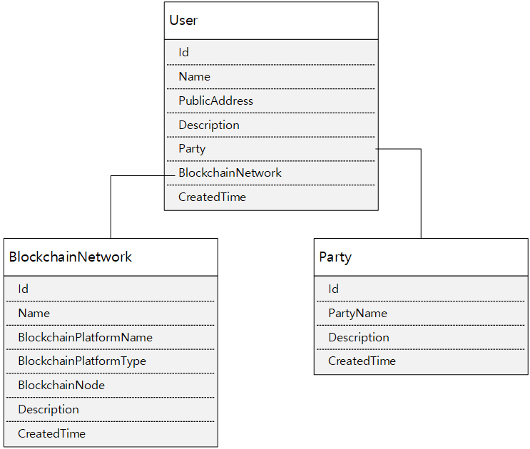

# NFT Token Service Management API
NFT Token Service Management API provides the feature for managing Blockchain Node, Consortium Party and User Information.

## Token Management Entity Class Relationships
The Entity Classes for User, BlockchainNetwork and Party has the relationships like blow:

  

BlockchainNetwork Entity has the information about Blockchain Transaction Node Information which is going to be used for submitting Transaction to specific HTTP RPC endpoint.  
Party Entity has the information about Blockchain Consortium network participant.
User Entity has the information about BlockchainNetwork and Party with his PublicAddress.  
All of thoese information is going to be used for preparing Blockchain Transaction signing and submit to specific RPC transaction endpoint.  

User should be registered after registering Blockhchain network and Party information.  
To integrating User Information and DApp Application, NFT Service consuming application should consider preparing mapping user table between NFT Service User Id and Application's user's identifier to make a relationships.

During registring User, NFT Service creates his/her Private Key and store it into Azure KeyVault.
Every Key per each User will be stored with their User ID as its Key.
Each User's Id should be unique and shoudn't be changed. If User entity has been deleted, coresponding User's Private Key in KeyVault will be terminated also.

## Token Management API
Below is the NFT Token Management API Descriptions  

| Verb | URL                                                          | Description                             |
|------|--------------------------------------------------------------|-----------------------------------------|
| GET  | /ServiceManagement/BlockchainNetworks/BlockchainNetwork/{Id} | Get BlockchainNetwork Information by Id |
| DELETE  | /ServiceManagement/BlockchainNetworks/BlockchainNetwork/{Id} | Delete BlockchainNetwork Information by Id |
| GET  | /ServiceManagement/BlockchainNetworks | Get All registered BlockchainNetworks Information |
| POST  | /ServiceManagement/BlockchainNetworks/BlockchainNetwork | Register BlockchainNetwork Information |
| GET  | /ServiceManagement/Parties/Party/{Id} | Get Consortium Party Information by Id |
| DELETE  | /ServiceManagement/Parties/Party/{Id} | Delete Consortium Party Information by Id |
| GET  | /ServiceManagement/Parties | Get All registered Consortium Parties Information by Id |
| POST  | /ServiceManagement/Parties/Party | Register Consortium Party Information |
| GET  | /ServiceManagement/Users/User/{Id} | Get User Information by Id |
| DELETE  | /ServiceManagement/Users/User/{Id} | Delete User Information by Id |
| GET  | /ServiceManagement/Users/User?PublicAddress={Id} | User Information by his/her PublicAddress |
| POST  | /ServiceManagement/Users/User | Register User Information |
| GET  | /ServiceManagement/Users | Get All Users Information |
